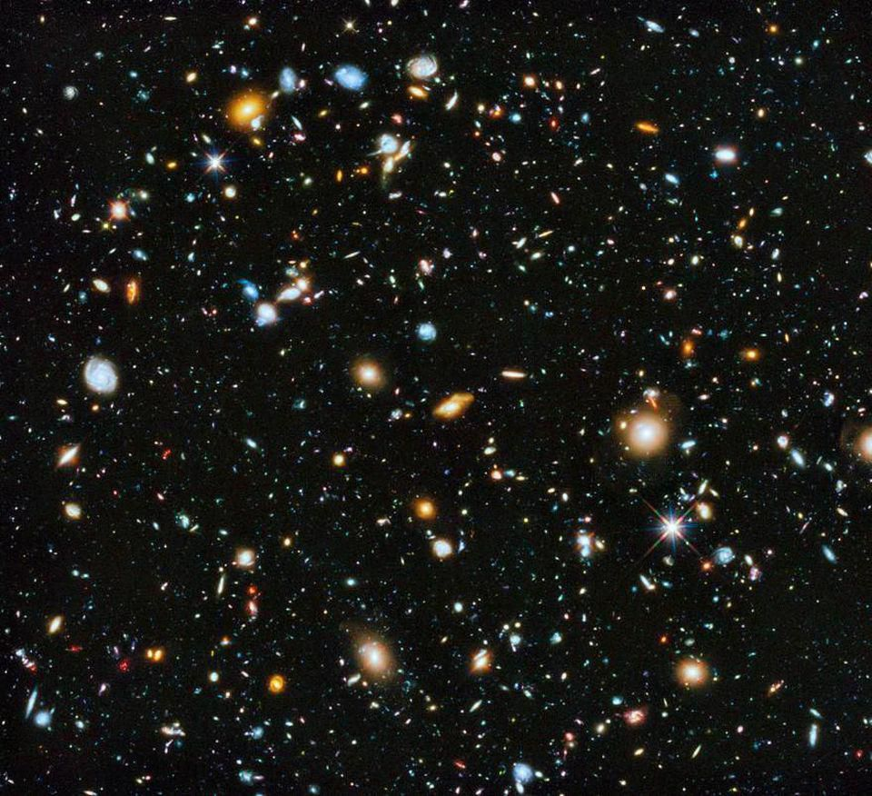
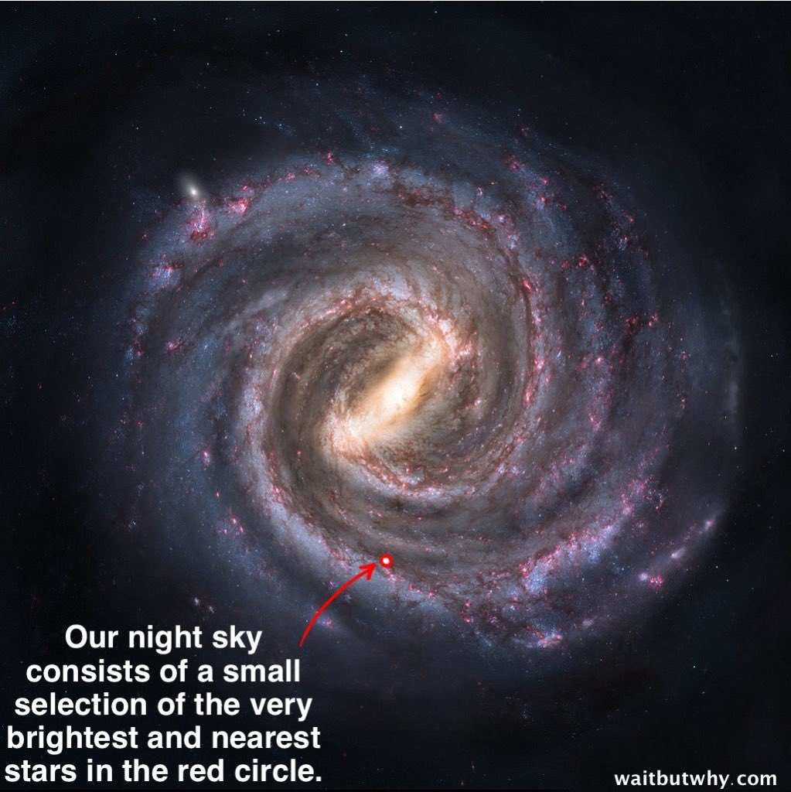
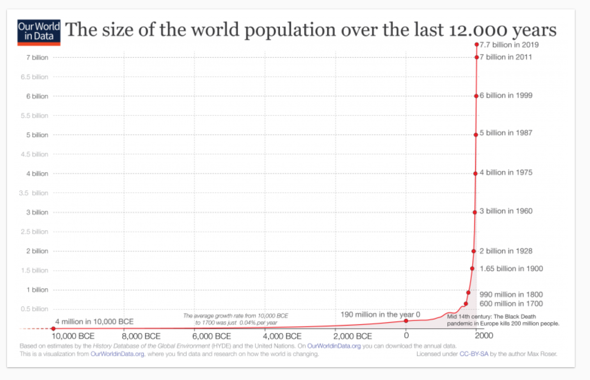
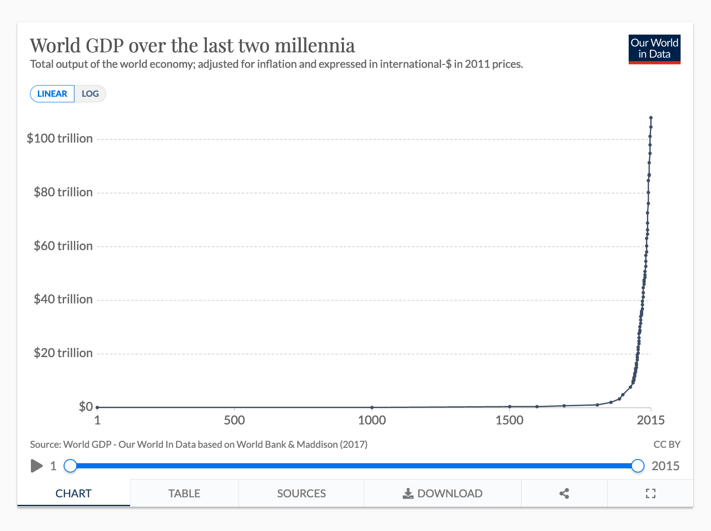
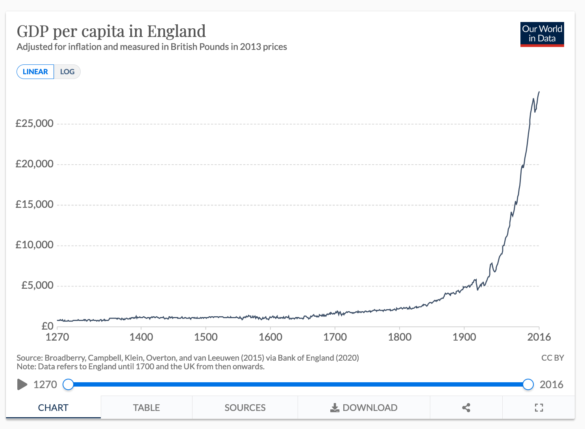
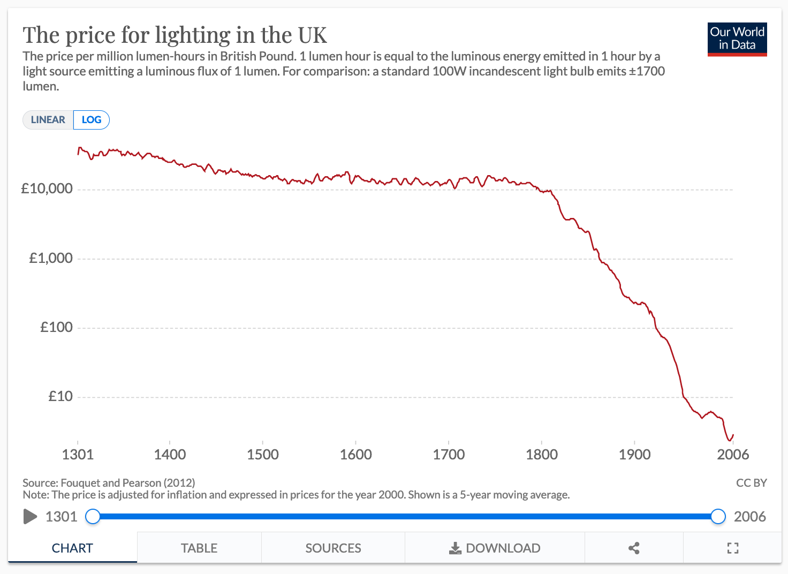

# Where am I?

## Big numbers
At 13.8 billion years young, the Universe is probably just getting started [1]. 

The early Universe was 75% hydrogen, 24% helium, and 1% lithium. The first stars formed about 13.2 billion years ago, and most of the heavier elements—including those that make up your body and most of what surrounds you—were formed in the huge explosions of dying stars.

The Sun is one of 250 billion stars in the Milky Way galaxy. The Milky Way is one of at least 200 billion galaxies in our observable Universe [2]. 

When you look at the night sky, the stars visible to the naked eye make up a tiny fraction of those in the Milky Way.

The Sun is a bit less than halfway through its 9.5 billion year life span. The Earth has been around 4.5 billion years.

Life on Earth has been around for at least 3.77 billion years, perhaps as long as 4.41 billion years. For most of that time, it was single cells. Multicellular life emerged about a billion years ago, and our aquatic ancestors crawled out of the sea about 500 million years ago.

Want to get a better sense of how big a million is? See [here](https://waitbutwhy.com/2014/11/from-1-to-1000000.html).

The Agricultural Revolution took place between 5-10,000 BCE, and the major world religions emerged 2-3000 years ago, roughly 60-90 human generations ago. 

About [108 billion humans have lived so far](https://www.prb.org/howmanypeoplehaveeverlivedonearth/). [People alive today have enjoyed and endured 15% of all the human experience there has ever been](https://www.lesswrong.com/posts/SwBEJapZNzWFifLN6/the-funnel-of-human-experience).

In terms of material wealth, I am among the 0.01% of most fortunate humans to have lived. My access to knowledge and information is without precedent.

I am writing this from a small village in England.

Hmm.

## Things are changing
If you zoom out and look at world population and GDP over the last 12,000 years, you’ll see that the rate of change was slow, then modest, and then... a couple hundred years ago, the party starts.

David Roodman [observes](https://www.openphilanthropy.org/blog/modeling-human-trajectory):

> The human economy has grown super-exponentially. The bigger it has gotten, the faster it has doubled, on average. The global economy churned out $74 trillion in goods and services in 2019, twice as much as in 2000. Such a quick doubling was unthinkable in the Middle Ages and ancient times. Perhaps our earliest doublings took millennia.

Hmm.

## What’s next?
Roodman again:

> Any system whose rate of growth rises with its size is inherently unstable. The human future might be one of explosion, perhaps an economic upwelling that eclipses the industrial revolution as thoroughly as it eclipsed the agricultural revolution. Or the future could be one of implosion, in which environmental thresholds are crossed or the creative process that drives growth runs amok, as in an AI dystopia.
> 
> […]
> 
> The range of possible futures is wide. So it is our task as citizens and funders, at this moment of potential leverage, to lower the odds of bad paths and raise the odds of good ones.

Brian Cox offers a [longer view](https://www.youtube.com/watch?v=uD4izuDMUQA):

> Life as we know it is only possible for 0.0000000000000000000000000000000000000000000000000000000000000000000000000000000000001% of the lifespan of the Universe (as measured from the Big Bang until the evaporation of the last black hole).

Hmm.

## Notes

1. A minority of apparently credible cosmologists [claim](https://www.nationalgeographic.com/science/article/101027-science-space-universe-end-of-time-multiverse-inflation) the Universe might have just 5 billion years to go. And I guess the simulation might get shut down.

2. Some estimate there are as many as 2 trillion galaxies.

<!-- #web/misc -->

<!-- {BearID:where-am-i.md} -->
