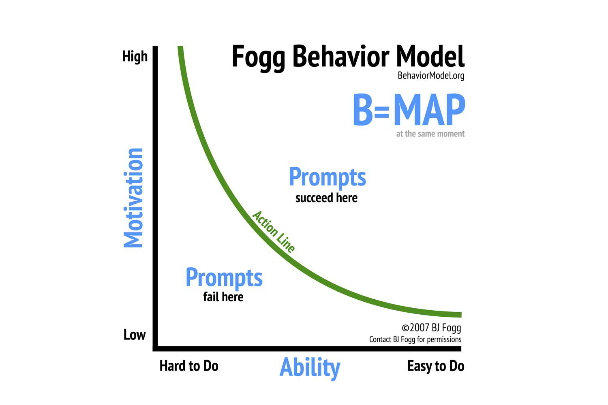

# B.J. Fogg
The Fogg Behaviour Model thinks of human behaviour as the product of motivation, ability and triggers.

Crucially: it is usually much easier to increase ability and improve the trigger regime than it is to increase motivation. So, if you want to do something, focus on making it easy to do—and think of doing—at the right time. This will often be sufficient! Only once you’ve made the behaviour very easy to do and remember should you consider trying to increase your motivation or “use your willpower”.

This insight has inspired a generation of digital product designers, for good and ill. In my own life, I’ve been applying the “make it easy and optimise triggers” insight for years and yet I still think I underuse the technique, and I’m still often surprised by just how powerful it is.

The other side of this insight is important too: if you want to inhibit a behaviour, [avoid triggers and make it harder](https://medium.com/@peterhartree/avoid-triggers-and-make-it-harder-c2b1a94d01c4).

It’s helpful to notice when others are trying to influence your behaviour in this way. The Fogg model implies we should raise an eyebrow at any service that makes itself very easy to use (e.g. social media sites that are free at the point of use). If you notice that someone has tried hard to make a thing easy to do, it is wise to ask “what do I really want here?” And: “am I liable to overconsume this thing?” Perhaps the designer is benevolently helping you learn French or achieve a fitness goal, but perhaps they are trying to make you spend more time looking at adverts. If you want to watch less television, throw away the remote control.

The power of this model, along with related findings about the power of defaults, framing effects, and so on, have made me more sympathetic to libertarian paternalism in policy and politics, and more inclined to cheer on the nudge crowd. I think we should consider tighter regulation around acceptable and unacceptable uses of the “make it easy / make it hard” levers. I’ve been heartened to see some application of benevolent sludge in recent years (e.g. banning the practice of placing cigarettes and sugary snacks at supermarket checkouts). Education also seems important: the Fogg behaviour model strikes me as a strong candidate for teenage curriculums.

I’ve been slightly obsessed with this model for years, yet I still think that—at least in practice—I underrate it. Perhaps you underrate it too.

Places to start:
* [Fogg behaviour model](https://www.behaviormodel.org/)
* [Avoid triggers and make it harder](https://medium.com/@peterhartree/avoid-triggers-and-make-it-harder-c2b1a94d01c4)
* Book: Tiny Habits (I’ve not read this, but I expect it’s good)

<!-- #web/people -->

<!-- {BearID:b-j--fogg.md} -->
