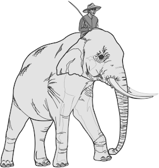

# Jonathan Haidt
Haidt’s [book on happiness](https://www.happinesshypothesis.com/chapters.html) explores 10 “great ideas” in the light of modern psychology. You can read it as a self-help book, but Haidt aims to describe “how to construct a life of virtue, happiness, fulfilment, and meaning”. I feel fortunate to have stumbled across the book in my late teens.

## The rider and the elephant

> The mind is divided in many ways, but the division that really matters is between conscious/reasoned processes and automatic/implicit processes. 

Think of the conscious mind as a rider atop an elephant: exercising a degree of control, but only insofar as the elephant—the unconscious mind—tolerates it. The unconscious mind is a chaotic collection of diverse and somewhat independent [modules](https://en.wikipedia.org/wiki/Modularity_of_mind). 

Haidt writes:

> Our minds are loose confederations of parts, but we identify with and pay too much attention to one part: conscious verbal thinking. […] Because we can see only one little corner of the mind’s vast operation, we are surprised when urges, wishes, and temptations emerge, seemingly from nowhere. We make pronouncements, vows, and resolutions, and then are surprised by our own powerlessness to carry them out. We sometimes fall into the view that we are fighting with our unconscious, our id, or our animal self. But really we are the whole thing. We are the rider, and we are the elephant. Both have their strengths and special skills.
> 
> […]
> 
> The rider can’t just decide to change and then order the elephant to go along with the program. Lasting change can come only by retraining the elephant, and that’s hard to do.
> 
> […]
> 
> Learning how to train the elephant is the secret of self-improvement. 

We can train the elephant through meditation, cognitive therapy, or other means of habit formation (e.g. simple repetition). Often, we can achieve big behaviour changes by making small changes to our environment: [if you make something easier to do, you are more likely to do it—and vice versa](b-j--fogg.md).

## The Hedonic treadmill
The “[hedonic treadmill](https://en.wikipedia.org/wiki/Hedonic_treadmill)” is the loop by which our desires, once satisfied, are replaced by new desires... endlessly.  

> On an exercise treadmill you can increase the speed all you want, but you stay in the same place. In life, you can work as hard as you want, and accumulate all the riches, fruit trees, and concubines you want, but you can’t get ahead. Because you can’t change your “natural and usual state of tranquility,” the riches you accumulate will just raise your expectations and leave you no better off than you were before. Yet, not realizing the futility of our efforts, we continue to strive, all the while doing things that help us win at the game of life. Always wanting more than we have, we run and run and run.

 
The treadmill story is combined with the claim that we have a [steady baseline level of subjective well being](http://changingminds.org/explanations/emotions/happiness/setpoint_happiness.htm) (a “hedonic set-point”) around which our moment-to-moment happiness varies. People vary in where their set-point lies, and this is partly determined by genetics. But, we have some ability to improve our happiness set-point, and finding ways to do this is one goal of the [positive psychology](https://en.wikipedia.org/wiki/Positive_psychology) movement. 

> The human mind is extraordinarily sensitive to changes in conditions, but not so sensitive to absolute levels.
> 
> […]
> 
> Whatever happens, you’re likely to adapt to it, but you don’t realize up front that you will. We are bad at “affective forecasting,” that is, predicting how we’ll feel in the future. We grossly overestimate the intensity and the duration of our emotional reactions. Within a year, lottery winners and paraplegics have both (on average) returned most of the way to their baseline levels of happiness. The lottery winner buys a new house and a new car, quits her boring job, and eats better food. She gets a kick out of the contrast with her former life, but within a few months the contrast blurs and the pleasure fades. 

We quickly adapt to most environmental changes, but there are some good things—and some bad things—we never fully adapt to. For example, “dependable companionship […] is a basic need; we never fully adapt either to it or to its absence.” An argument for close friendships and marriage, but it comes with a warning:

> conflicts in relationships—having an annoying office mate or room-mate, or having chronic conflict with your spouse—is one of the surest ways to reduce your happiness. You never adapt to interpersonal conflict, it damages every day, even days when you don’t see the other person but ruminate about the conflict nonetheless.

In short: Buddha and the Stoics were onto something, but some things are worth striving for.

## Rationalisation
> If you listen closely to moral arguments, you can sometimes hear something surprising: that it is really the elephant holding the reins, guiding the rider. It is the elephant who decides what is good or bad, beautiful or ugly. Gut feelings, intuitions, and snap judgments happen constantly and automatically […] but only the rider can string sentences together and create arguments to give to other people. In moral arguments, the rider goes beyond being just an advisor to the elephant; he becomes a lawyer, fighting in the court of public opinion to persuade others of the elephant’s point of view.

It’s hard not to recall Nietzsche’s description of philosophers:

> advocates who refuse the name […] wily spokesmen for their prejudices, which they dub ‘truths’; and they are […] very far from having the good taste to announce it bravely, whether to warn a foe or a friend, or simply from high spirits and self-mockery.

Elsewhere, Haidt writes:

> if you think about moral reasoning as a skill we humans evolved to further our social agendas–to justify our own actions and to defend the teams we belong to–then things will make a lot more sense…people’s moral arguments [are] mostly post hoc constructions made up on the fly, crafted to advance one or more strategic objectives. 

I find the Haidt/Nietzsche picture compelling on priors. How should moral philosophers respond to this? One response is a greater skepticism towards claims of impartiality or access to universal truths, a greater tendency to ask: who benefits? 

> We do moral reasoning not to reconstruct that actual reasons why *we ourselves* came to a judgment; we reason to find the best possible reasons why *somebody else ought to join us* in our judgment. 

Somehow I’ve not yet read _The Righteous Mind_… I am looking forward to it. Haidt, by way of Joseph Walker, recently asked Peter Singer for his thoughts on “Durkhemian utilitarianism”. Quoting from _The Righteous Mind_:

> A Durkheimian society at its best would be a stable network composed of many overlapping groups that socialise, reshape and care for individuals who, if left to their own devices, would pursue shallow, carnal and selfish pleasures. A Durkheimian society would value self-control over self-expression, duty over rights and loyalty to groups over concerns for out groups. […] Utilitarians since Jeremy Bentham have focused intently on individuals. They try to improve the welfare of society by giving individuals what they want. But a Durkheimian version of utilitarianism would recognize that human flourishing requires social order and embeddedness. It would begin with the premise that social order is extraordinarily precious and difficult to achieve. A Durkheimian utilitarianism would be open to the possibility that the binding foundations—Loyalty, Authority, and Sanctity—have a crucial role to play in a good society. I think Bentham was right that laws and society should aim as a first approximation to produce the greatest total good. I just want Bentham to read Durkheim, to recognise that we are homo duplex (the products of multi-level selection) before he tells any of us or our legislators to go about maximising total good.

Where to start:
* [Happiness Hypothesis book outline](https://www.happinesshypothesis.com/chapters.html)
* [The Righteous Mind: Summary & Review](https://forum.effectivealtruism.org/posts/SbwWBhi6T6qZwxu2X/the-righteous-mind-book-review)

