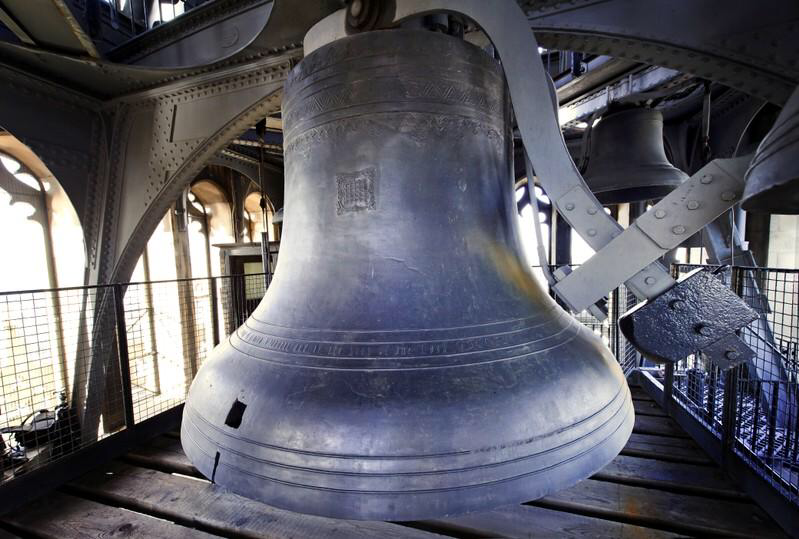

# Stewart Brand

Highlights from Brand’s 1999 book, [The Clock of The Long Now](https://www.amazon.com/Clock-Long-Now-Time-Responsibility/dp/0465007805). 

The challenge:

> How do we make longterm thinking automatic and common instead of difficult and rare? How do we make the taking of long-term responsibility inevitable?

The response: a clock and a library, a “mechanism and a myth” built to last for 10,000 years.

> Such a clock, if sufficiently impressive and well engineered, would embody deep time for people. It would be charismatic to visit, interesting to think about, and famous enough to become iconic in the public discourse. Ideally, it would do for thinking about time what the photographs of Earth from space have done for thinking about the environment. Such icons reframe the way people think.

The ambition:

> Clock/Library is an extravagant project. The more over the top it is the better it works. If it wants to compete for iconic power with the mushroom cloud and the photos of Earth from space, it has to match their vaulting ambition. (Let’s split the atom! Let’s leave Earth!) The great time-spanning precedent is the pyramids of Giza. Their massive monumentality defined when “history” began. They are a stabilizer, a frame of reference, for any culture that cares to care about them. The pyramids also demonstrate the power of folly. You can’t argue with them because they’re not rational.
> 
> The ambition and folly of the Clock/Library is to reframe human endeavor, and to do so not with a thesis but with a thing. All this thing can do is give permission to think long term. If it succeeds in that, the rest may follow.
> 
> [...]
> 
> Clock/Library aims for the mythic depth to become, as Brian Eno puts it, “one of those system-level ideas which sets in motion all sorts of behavior without ever having to be referred to directly again. This is what dominant myths do: they make some sorts of behavior ring with recognition and familiarity and value and a sense of goodness, and thus lay deep templates for social cohesion about what would otherwise be very hard-to-discuss topics.”

A precedent:

> An example of spontaneous reframing occurred in 01969, when the Apollo program began returning color photographs of the Earth from space. Everyone saw the photographs and saw that we occupied a planet that was beautiful, all one, very finite, and possibly fragile. The environmental movement took off from that moment—the first Earth Day was in 01970. That effect of the American space program was never intended or anticipated.

Another: 

> You can stand it bare-eared, even revel in it. It shakes you physically, like the roar from a space-rocket launch. You are at the core sound of Britain and its abiding myth. Big Ben live strikes the hour on BBC worldwide—its first hour strike exact to the second. This sound achieved its abiding stature when it was broadcast throughout the duration of World War II to a global audience, pealing out freedom and steadfastness for millions.
> 
> Eno: “What interests me is the fact of this clock being so closely identified with our self-image. Big Ben is a sort of throbbing heart for British culture—calm, assured, implacable, accurate (and thus “just”), enduring, and big. This list represents just about all the things Britain used to think it was, and would still like to think it is.”

Lengths of now:

> The shortest now is performed in a poem by the Polish poet Wislawa Szymborska:
> 
> When I pronounce the word Future, 
> the first syllable already belongs to the past.

Brian Eno, on the desire to extend our now:

> I realized that the “here” she lived in stopped at her front door. This was a very strange thought to me. My “here” includes the neighborhood at least. After that, I noticed that young arty New Yorkers were just as local in their sense of “now.” “Now” meant “this week.” Everyone had just got there, and was just going somewhere else. No one had any investment in any kind of future except their own, conceived in the narrowest terms.
> 
> I wrote in my notebook that December, “More and more I find I want to be living in a Big Here and a Long Now.” I guess part of the reason the idea attracted me is that it offered a justification for the type of music I was starting to make at the time—a music which was sort of suspended in an eternal present tense.”

Brand comments:

> For most of us most of the time I think Eno is right: “now” consists of this week, slightly haunted by the ghost of last week. This is the realm of immediate responsibility, one in which we feel we have volition, where the consequences of our actions are obvious and surprises limited. The weekend is a convenient boundary.

The clock will help us manage a transition:

> “In some sense, we’ve run out of our story, which was the story of taking power over nature. It’s not that we’ve finished that, but we’ve gotten ahead of ourselves, and we don’t know what the next story is after that.” The Clock is a way of bridging between stories, embodying respect for the full span of the old story and confidence in the gradual emergence of a new story. It is a transition-managing device.

Echoes of Derek Parfit, who is cited at one point:

> The number of human beings now alive is around six billion. The estimated number of humans who have ever been alive is about one hundred billion. What is the number of humans who will be alive? We owe the past humans our existence, our skills, and our not-bad world. What do we owe the future humans? Existence, skills, and a not-bad world. Maybe even a better world.

Continuity:

> Those original farmers ten millennia ago were the first systemic futurists. They mastered the six-month lag between sowing and reaping, and they remembered enough crop experience and matched it with enough astronomy to be able to use the sky as an accurate signal of when to plant. Such tricks confer advantage.
> 
> […]
> 
> The trick is learning how to treat the last ten thousand years as if it were last week, and the next ten thousand as if it were next week. Such tricks confer advantage.

Long term solutions, and dreams:

> Danny Hillis points out, “There are problems that are impossible if you think about them in two-years terms—which everyone does—but they’re easy if you think in fifty-year terms.” This category of problems includes nearly all the great ones of our time: The growing disparities between haves and have nots, widespread hunger, dwindling freshwater resources, ethnic conflict, global organized crime, loss of biodiversity, and so on. Such problems were slow to arrive, and they can only be solved at their own pace. It is the job of slow-but-steady governance and culture to set the goals of solving these problems and to maintain the constancy and patience required to see them through (that is not our current model of governance).
> 
> Restorative goals such as these are the most important, but they do have a negative cast. Could their accomplishment be aided by also engaging some positive goals that operate at the same pace? Colonizing Mars has this quality. Building a 10,000-Year Clock/Library might. Assembling a universal virtual-reality world on the Net feels like an achievable great work.
> 
>  […]
> 
> These are first-thought blurts. We have not yet seriously asked ourselves what we might do with fifty years or five hundred years of sustained endeavor. What comes to your mind, thinking in that scale?

The experience:

> You exit your vehicle in a parking area at the base of a mountain somewhere in the high desert of the Southwest United States. Looking up, you see a flight of shallow steps, each step carved from a layer of rock representing approximately 10,000 years of geologic time. After climbing one hundred of these steps, or one million years into the future, you are somewhat awed and belittled by the greatness of geologic time.
> 
> You arrive at a flat knoll where you see a cave ahead. Through the opening of the cave you see some large but slow movement. You proceed and gradually make out a giant pendulum swinging back and forth deep within the cave. Once you reach the center you realize that you are actually within the clock mechanism itself and you are aware of the pendulum beating out its 10-second period. You proceed up a spiral staircase that will take you through the relatively low ceiling and up into the first layer of clock mechanics. On this layer you see the fastest of the mechanical calculation devices, which ticks once per day. As you go up flight after flight you see each progressive mechanism with its relatively slower tick, the last being the precession of the equinoxes, a 25,784-year cycle. The next few layers are the abstraction layers that adjust solar time to actual time and the delay for the pendulum-impulsing mechanism. When you reach the top of the stairs you are in a huge room several stories tall. It is dimly lit from a slot cut through the living rock of the mountain on the southern face. You make out two giant helices, one descending either wall, each being rotated by a falling weight that must weigh several tons. Then you are surprised by an immediate brightness in the room. It is coming from the sun that has just become directly in line with the slit on the wall. It is reflecting off a hemispherical mirror lighting up the whole room and heating up a sphere in the center of a great dial. The heating of this sphere actuates a synchronization mechanism which automatically adjusts the time of the clock to local noon. You are able to make out the dial around this sphere, now showing you the year in the cryptic method of keeping time when this clock was built. It reads the year 11,567. You then look at the rings in from this to find images you recognize of the Sun and Moon in their current phases, as well as a diagram of the current night sky. From these you are able to work backward the actual time to your newer and more familiar time scale. But you are struck that the people of this ancient time had the foresight to think this far into their future and create this place. At this point you wander through the rest of the facility to find a library and people accessing and preserving the data stored there. Akin to the truly ancient library of Alexandria, there is a constant forward migration of the data to increasingly better and denser methods of storage. In the main vault you find the original 1,000 books stored at the impossibly large scale of 100 nanometer pixels. These were the first 1,000 books stored in the Clock/Library chosen by its founders. Although not necessarily relevant to your time, what they began helped to teach people the value of knowledge over long periods of time. Without it humanity might have obsolesced itself out of existence without being able to look over the ancient records of the sea and air and find trends that are only apparent over centuries or millennia.

Where to start:
* [The Clock of The Long Now](https://www.amazon.com/Clock-Long-Now-Time-Responsibility/dp/0465007805)
* [The 10,000 Year Clock](https://longnow.org/clock/)
* [Brand’s homepage](http://sb.longnow.org/SB_homepage/Home.html)
