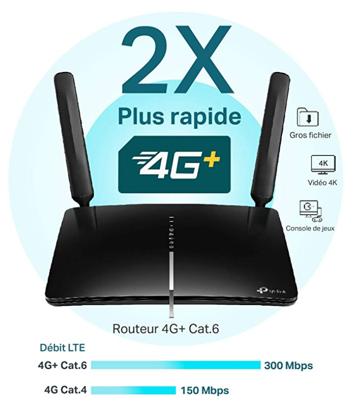

# Buy a 4G router (it’s much better than a mobile phone hotspot)
A fast, reliable mobile data connection is useful when travelling. 

For many years, I used a mobile phone hotspot. But it turns out that dedicated hardware—namely a 4G router—can achieve much faster connection speeds, mainly due to a better antenna.

This was one of those facepalm realisations: it just hadn’t occurred to me that powerful routers which accept a SIM card might exist. So yeah, this is another entry in the “things I wish I’d discovered 5+ years ago” list. 

I use a [TP-Link MR 600](https://www.amazon.fr/TP-Link-MR600-Antennes-Amovibles-Op%C3%A9rateur/dp/B07RS7HM59/ref=sr_1_2?dchild=1&keywords=TP-Link+AC1200+4g&qid=1603177691&s=computers&sr=1-2). It’s light (~250g) and the antenna are easily removed, so it’s about the size of a book in your luggage. 

As of 2020: in the UK, Three Mobile has the best roaming data plans. In France, it’s Free Mobile. 

 

<!-- #web/useful -->

<!-- {BearID:buy-a-4g-router-(it’s-much-better-than-a-mobile-phone-hotspot).md} -->
