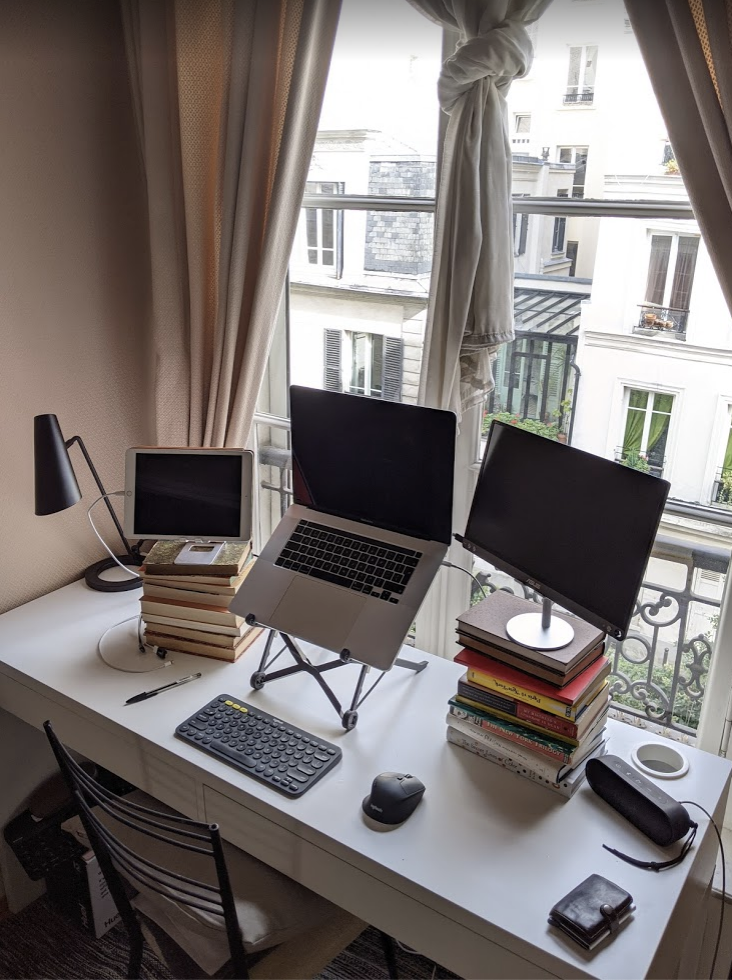

# How to travel with four screens
I travel quite a bit, but I often want to work with several screens [1]. 

For a few years, my solution was to own two cheap 24” monitors and carry them around in the central compartment of [this suitcase](https://www.amazon.co.uk/gp/product/B0771STH4V/ref=oh_aui_detailpage_o07_s00?ie=UTF8&psc=1), wrapped in a yoga mat.

This was okay, but the screens took a lot of space in my luggage, and they were kinda heavy. After dozens of journeys, eventually one screen was broken in transit. And it was always annoying to faff around with three power plugs (one for each screen, plus one for my laptop) and the relevant UK / EU / US adaptors. 

Lately I’ve switched to a much better setup:
* 1x 16” MacBook Pro
* 2x 16” [Asus Zenscreen](https://www.amazon.co.uk/ASUS-ZenScreen-MB16ACE-Portable-Anti-glare/dp/B082CVXQLX/ref=sr_1_1?dchild=1&keywords=zenscreen&qid=1617294238&s=electronics&sr=1-1) portable monitor (model MB16ACE)
* 1x iPad ([Sidecar](https://support.apple.com/en-gb/HT210380) lets you use an iPad as a display) 

The best thing about this setup is that I can easily fit all four devices in the laptop compartment of my [backpack](https://knomo.com/collections/backpack-men/products/christowe-laptop-backpack-black-160-403-blk). That’s a huge space saving!! 

The total weight is several kilograms lighter. And the setup requires just one power plug: both the Zenscreen and the iPad draw power from the USB-C ports on the laptop.

Here’s a picture of the three screen version:

The main way this setup is worse than my old one is that the screens are smaller. It turns out that screen size matters less than I thought: I mainly just want more places to put things. I expect I will buy larger screens when I finally settle in one place for a reasonable duration, but for travel, I’m delighted with this setup.

Also pictured: Logitech K380 keyboard and Logitech M720 mouse. Both are great. They can be paired with up to three devices (including an iPad), and you can switch between paired devices with one button press. An iPad plus a K380 keyboard makes for a [great writing setup](my-setup-for-writing.md).

For stands, I use:
* 3x [ProCase foldable stands](https://www.amazon.co.uk/gp/product/B08CH245V4/ref=ppx_yo_dt_b_asin_title_o02_s00?ie=UTF8&psc=1)
* 1x [Nexstand](https://www.amazon.co.uk/NEXSTAND-K2-Adjustable-Foldable-Portable/dp/B01HHYQBB8/ref=sr_1_8?dchild=1&keywords=laptop+stand+folding&qid=1617294177&s=electronics&sr=1-8) for the laptop.
 
[1] I find four screens is ideal when coding, and two screens when doing research. For writing, one screen is best! 

<!-- #web/useful -->

<!-- {BearID:how-to-travel-with-four-screens.md} -->
