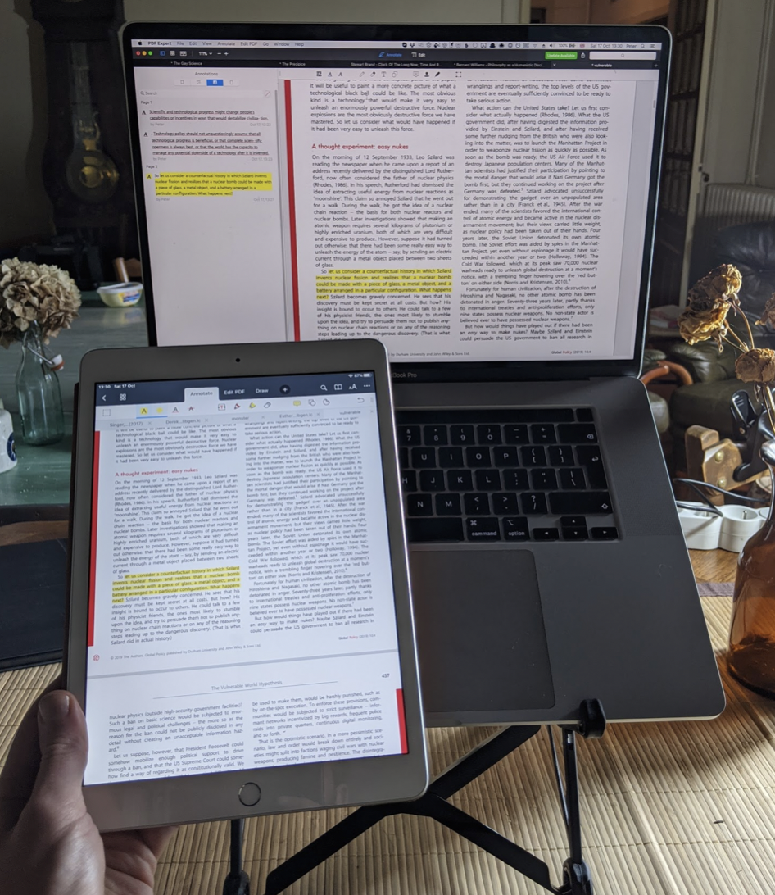
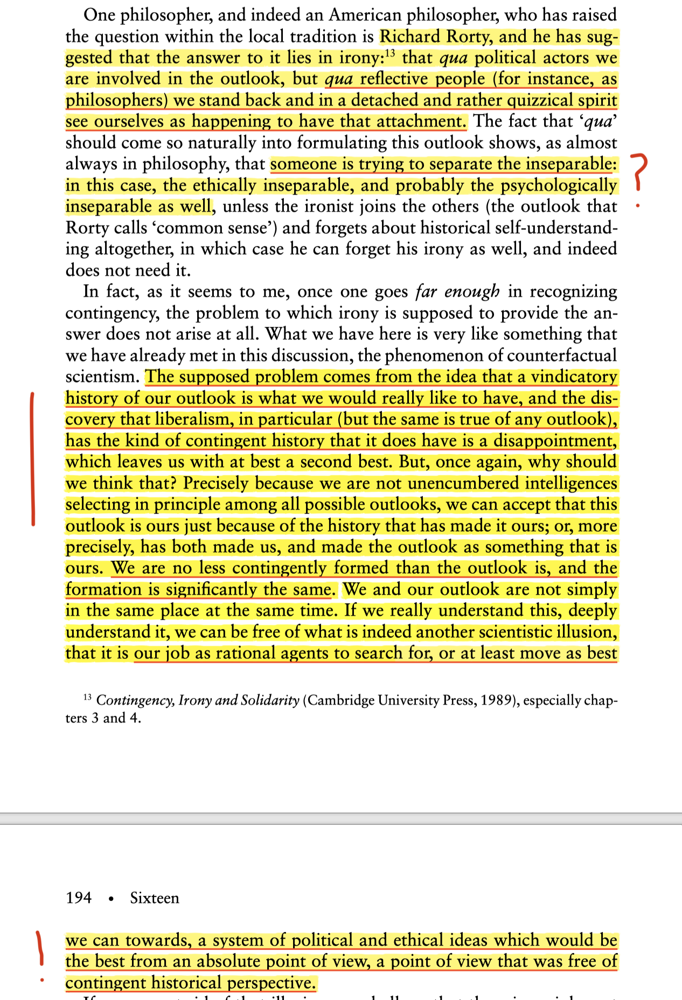
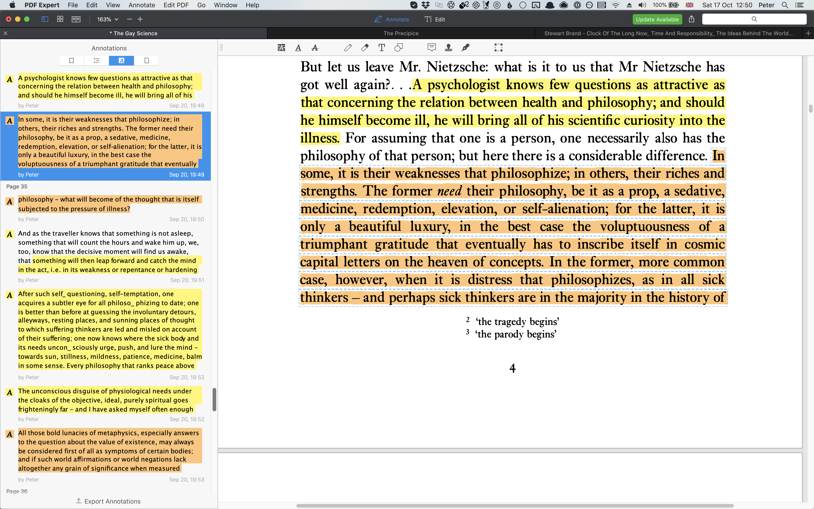
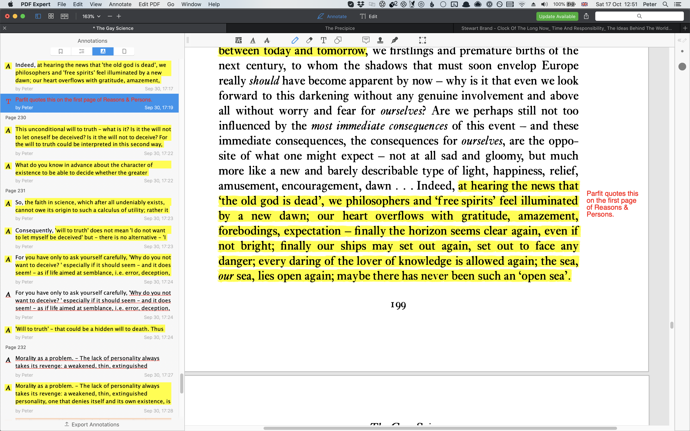

# My setup for reading, highlighting and annotation
Before 2020, I did most of my reading on Kindle, and would use [Klib](http://klib.me/) to copy-paste my reading highlights into my notes database.

In 2020 I found a much better option:

1. Read and highlight using [PDF Expert](https://pdfexpert.com/) on iPad, MacBook, or iPhone.
2. Copy-paste or export highlights from PDF Expert to my notes database.

The [PDF Expert](https://pdfexpert.com/) website somewhat buries the lede about what a great workflow their software enables, so I’ll highlight the features I most value below.

### Easily sync annotations between iPad, MacBook & iPhone
Store your PDF files in the “PDF Expert” folder on your iCloud Drive. Then, iCloud will sync your files—including your highlights and annotations—between devices. (The sync happens automatically within a few minutes.)

I now use an iPad as my main reading device, an iPhone for reading on the go, and my MacBook for more intense reading and research sessions. 

### Great highlight & annotation tools
You can highlight in any colour, draw with a pen, underline in red, or add text in any colour.

### Reasonable UI for browsing highlights and annotations
The annotations sidebar shows everything you added, with click to jump. 
 

### Easy export to HTML, markdown or text
There’s an “Export annotations” button on the annotations sidebar. If you want just a subset of your annotations, select them.

At some point, I’ll look at writing a script to automate this.

### Straightforward copy-paste text from most PDFs
I find that PDF Expert can copy-paste text much more reliably than Adobe Acrobat or Mac OS Preview. I don’t know what they’re doing to achieve this.

PDF Expert does not have built-in OCR for scanned documents yet, but [they are working on it](https://pdfexpert.com/help/50-any-plans-to-provide-ocr-functionality-in-pdf-expert-for-mac.html).

## The catch: you can only read PDF files & web pages
PDF Expert can only open PDF files or web pages (which it can convert to PDF).

Most academic papers are available as PDF, but many books are difficult to buy in PDF format. Fortunately, most of the books I want to read are available on [Libgen](libgen.li/) [1]. 

Sometimes I can only find .epub files in Libgen. In that case, I use either of these services to convert to PDF (leaving all the settings to default):
* [Online Convert](https://ebook.online-convert.com/convert-to-pdf)
* [Zamzar](https://www.zamzar.com/convert/epub-to-pdf/)

[1] I feel bad about having a setup that makes systematic use of Libgen. For now, my solution is to see Libgen as analogous to a public library, and to buy digital or paper copies of books I spend more than an hour with.

<!-- #web/useful -->

<!-- {BearID:my-setup-for-reading-highlighting-and-annotation.md} -->
