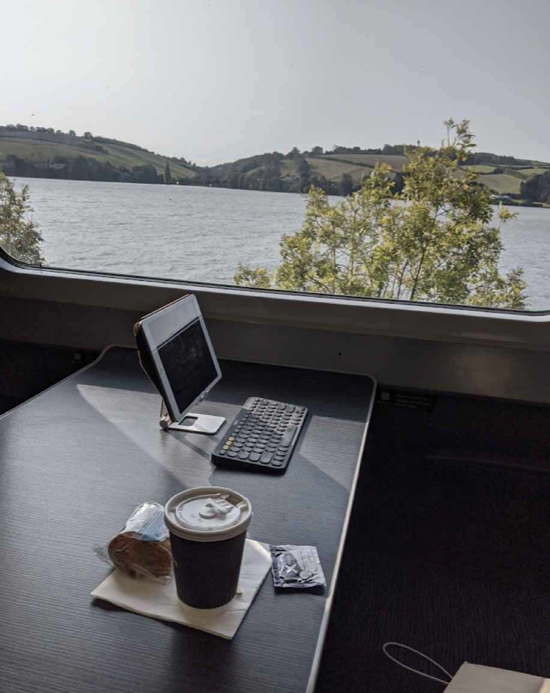
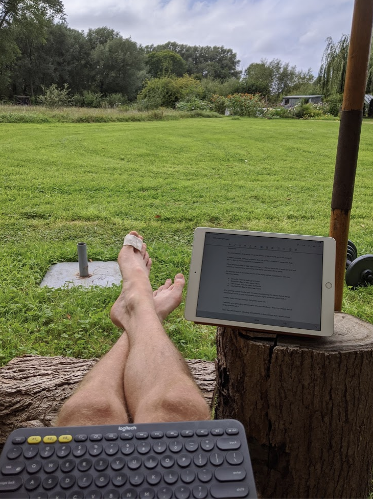

# My setup for writing
iPads are surprisingly good for writing. Some of the more important but less obvious reasons are:

1. It’s a bit of a faff to switch between windows. This makes it easier to stay focussed.
2. If you want to be discreet, you can type on the touchscreen keyboard.
3. The touchscreen keyboard makes you type more slowly, and that is sometimes helpful.
4. You can easily pair a bluetooth keyboard if you want to.
5. If you’re editing, you can also pair a bluetooth mouse.
6. iPad battery life is better than your laptop, and it’s easier to charge with a [portable battery](buy-a-portable-battery.md).
7. You can use the iPad as a second screen for your MacBook ([instructions](https://support.apple.com/en-gb/HT210380)).

Some people recommend using a dedicated device for writing, on the grounds that it helps with focus and establishing a regular writing habit. One thing this means is you can avoid installing “inbound” apps, like email, messaging or social media.

Pen and paper usually doesn’t work for me, but I carry a pocket journal and a black ballpoint just in case.

## Key ingredients
* iPad with Apple smart case
* Logitech K380 bluetooth keyboard
* [ProCase foldable stand](https://www.amazon.co.uk/gp/product/B08CH245V4/ref=ppx_yo_dt_b_asin_title_o02_s00?ie=UTF8&psc=1)
* [Bear](https://bear.app/) or Google Docs 

## Accessories
* Logitech M780 bluetooth mouse
* [Moleskin pocket journal](https://gb.moleskine.com/cahier-journals-tender-yellow/p1637)
* [Black Bic Crystal Ballpoint pen](https://www.amazon.co.uk/Bic-Crystal-Ballpoint-Medium-Point/dp/B00903C416?th=1)

## Other options
You could buy an iPad case with built-in keyboard, but they’re more expensive than the Logitech K380 and seem worse to type on.

I considered an iPad Pro but I’m not sure that the larger screen is worth the portability hit. It’s also much more expensive than a regular iPad. The best argument for iPad Pro might be that it supports the 2nd generation Apple Pencil. The first generation Apple Pencil is a pain to charge and doesn’t easily attach to the iPad.

Wirecutter [thinks](https://www.nytimes.com/wirecutter/reviews/the-ipad-is-the-best-tablet/) the iPad is better than other tablets. For writing, the cheapest 32GB wifi-only model is fine (you can connect to the internet via your smartphone hotspot if you need to).

In the past I used a small Chromebook as my main writing device. It was fine, and might be your best bet if you want a cheaper option or prefer the Google ecosystem. 

## This setup in the wild
On the train:

On a terrace, discretely:

In a tent:

<!-- #web/useful -->

<!-- {BearID:my-setup-for-writing.md} -->
